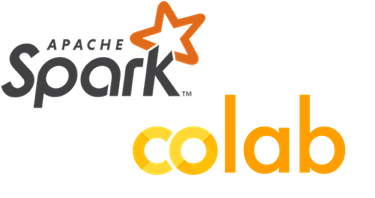

# How to Install Apache Spark in Google Colab




* Go to https://colab.research.google.com/ and create a NEW NOTEBOOK.
* Give your notebook a name so you can reference this notebook later
* The code below will install and configure the environment with lates Spark version 2.4.5

```python
!apt-get install openjdk-8-jdk-headless -qq > /dev/null
```

Run the cell. Then

```python
!wget -q https://apache.osuosl.org/spark/spark-2.4.5/spark-2.4.5-bin-hadoop2.7.tgz
```

Run the cell. Then

```python
!tar xf spark-2.4.5-bin-hadoop2.7.tgz
```

Run the cell. Then

```python
!pip install -q findspark
```

Finally 

```python
import os
os.environ["JAVA_HOME"] = "/usr/lib/jvm/java-8-openjdk-amd64"
os.environ["SPARK_HOME"] = "/content/spark-2.4.5-bin-hadoop2.7"
```

Run the cell.

To verify type

```python
os.environ["SPARK_HOME"]
```

And you should see

```
'/content/spark-2.4.5-bin-hadoop2.7'
```

---

### Starting a Spark Session using the code below

```python
import findspark
findspark.init()
from pyspark.sql import SparkSession
spark = SparkSession.builder.master("local[*]").getOrCreate()
```

---

### Install `spark-nlp`

```python
pip install spark-nlp==2.4.2
```

And run the cell. 


Once completed for testing to make sure everything is loaded and ready run the code below

```python
import sparknlp

spark = sparknlp.start()

print("Spark NLP version: ", sparknlp.version())
print("Apache Spark version: ", spark.version)
```

You should see the below

```
Spark NLP version:  2.4.2
Apache Spark version:  2.4.5
```

